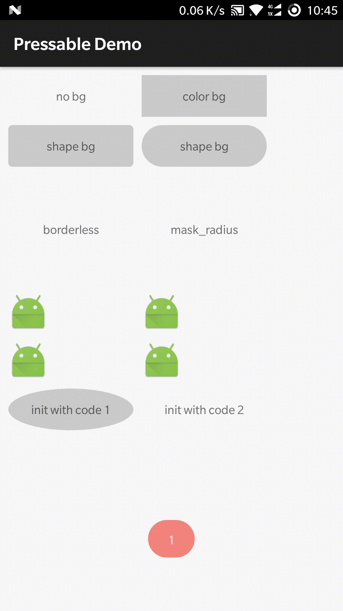

# pressable
这是一个按钮效果库，解放双手，再也不用写selector

5.0及以上版本自动应用ripple（波纹）效果，5.0以下使用StateListDrawable，按下直接变色

直接上图：



## How to

To get a Git project into your build:

Step 1. Add the JitPack repository to your build file

Add it in your root build.gradle at the end of repositories:
```gradle
	allprojects {
		repositories {
			...
			maven { url 'https://jitpack.io' }
		}
	}
```
Step 2. Add the dependency:
```gradle
	dependencies {
	        compile 'com.github.wtuadn:pressable:v1.1.0'
	}
```

代码很简单，使用很方便

```xml
<com.wtuadn.pressable.PressableTextView
            android:layout_width="150dp"
            android:layout_height="50dp"
            android:gravity="center"
            android:onClick="onClick"
            android:text="no bg"
            app:pressed_color="@color/default_black_pressed_color" />
```

> 不管是用xml设置还是用代码设置，最终都会执行**PressableUtils.setPressableDrawable**方法

自带PressableFrameLayout、PressableLinearLayout、PressableRelativeLayout、PressableImageView、PressableTextView五种常用控件

有特殊需要的可以继承相应view并实现IPressable接口

## Tips
borderless模式与view的背景冲突，设置了borderless="true"就不要设置背景了